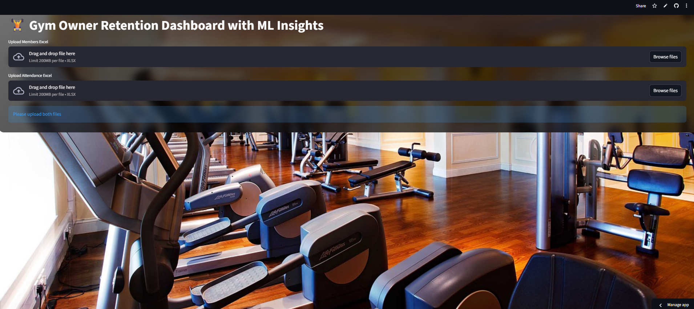

# 🏋️ Gym Owner Retention Dashboard

A **Streamlit-based dashboard** for gym owners to track member engagement, predict churn using **Machine Learning (Random Forest)**, and plan retention actions. Provides insights, metrics, and Excel export for recovery plans.

---

## 🔹 Features

- **Member Analytics**
  - Track total members, high-risk members, average visits per week, and payment ratio.
- **Churn Prediction (ML)**
  - Uses **Random Forest Classifier** to predict churn probability.
  - Assigns **Risk Levels**: High, Medium, Low.
- **Actionable Insights**
  - Recommended actions & coupon offers based on risk level.
- **Interactive Visualizations**
  - Risk distribution (donut chart)
  - Engagement spread (box plot)
  - Payment behavior (violin plot)
  - Churn intensity by plan (bar chart)
  - Before vs After Retention impact (line chart)
- **Excel Export**
  - Download member recovery plan with actions, coupons, and risk levels.
- **Filters**
  - Dynamic sidebar filters for risk levels.

---

## 🔹 Screenshots

---
